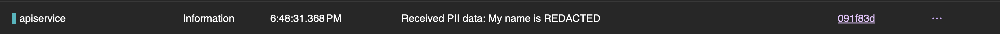

# Aspire PII Sample

This sample demonstrates how PII Redaction using [Microsoft Presidio](https://microsoft.github.io/presidio/) can be achieved in a [.NET Aspire](https://learn.microsoft.com/en-us/dotnet/aspire/get-started/aspire-overview) Application.

## How this sample works:
This sample leverages a custom OpenTelemetry Processor: [PresidioRedactionProcessor](https://github.com/RKapadia01/PresidioRedactionProcessor). An Otel Collector equipped with this processor is deployed into the Aspire AppHost via a custom extension:

```C#
builder.AddPresidioCollector(configPath: "./config.yaml");
```

This extension will spin up an OpenTelemetry Collector as a docker sidecar when the Aspire AppHost is run, and will configure all applications to first send it's telemetry data to the collector for PII Redaction, before being forwarded on to the Aspire Dashboard.

The OpenTelemetry Collector relies on a `config.yaml` file, which configures the PresidioRedactionProcessor, as well as ensures that Telemetry data is forwarded to the appropriate Aspire Dashboard Endpoint:

```yaml
receivers:
  otlp:
    protocols:
      grpc:
        endpoint: 0.0.0.0:4317
      http:
        endpoint: 0.0.0.0:4318

processors:
  presidio_redaction:
    mode: "embedded"
    error_mode: "propagate"
    analyzer:
      language: "en"
      score_threshold: 0.5
    anonymizer:
      anonymizers:
        - entity: "DEFAULT"
          type: "REPLACE"
          new_value: "REDACTED"

exporters:
  otlp/aspire:
    endpoint: ${ASPIRE_OTLP_ENDPOINT}
    tls:
      insecure: true

service:
  pipelines:
    traces:
      receivers: [otlp]
      processors: [presidio_redaction]
      exporters: [otlp/aspire]
    logs:
      receivers: [otlp]
      processors: [presidio_redaction]
      exporters: [otlp/aspire, debug]
    metrics:
      receivers: [otlp]
      processors: []
      exporters: [otlp/aspire]
```

## Running the Sample:
- Run the AppHost Project from your Terminal:
    ```C#
    dotnet run --project aspire-pii.AppHost
    ```

- Open the Web APP located at `http://localhost:5220/`
- Type in some information containing PII, and Submit the Data
- Inspect the Structured Logs in your Aspire Dashboard:
